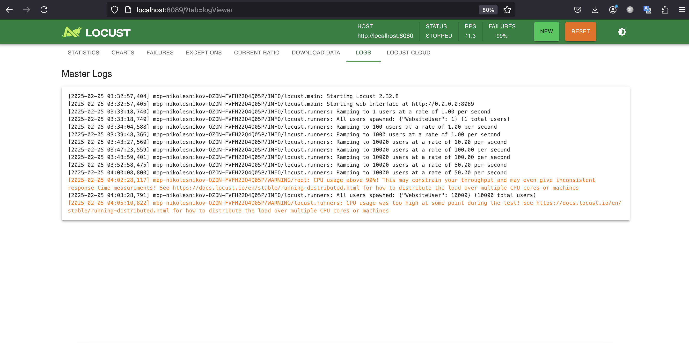
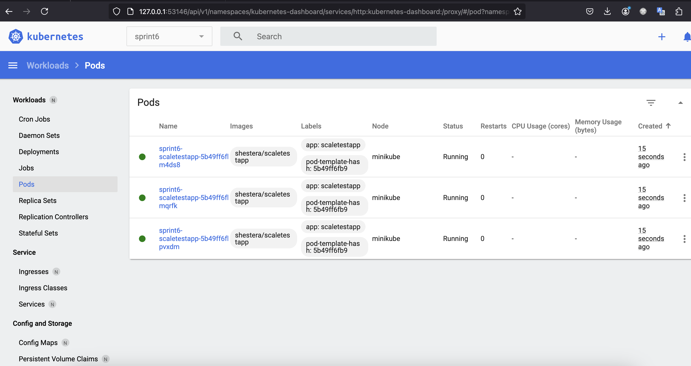
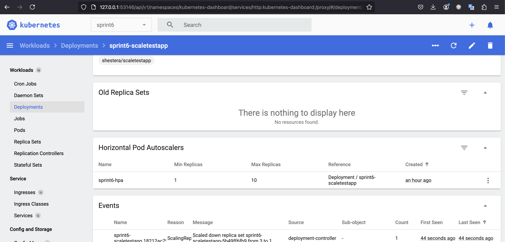

# Задание 2. Динамическое масштабирование контейнеров

## Лог действий

```bash
➜  Exc2 git:(sprint_6) ✗ nvim deployment.yaml
➜  Exc2 git:(sprint_6) ✗ cat deployment.yaml
apiVersion: apps/v1
kind: Deployment
metadata:
  name: sprint6-scaletestapp
  labels:
    app: scaletestapp
spec:
  replicas: 3
  selector:
    matchLabels:
      app: scaletestapp
  template:
    metadata:
      labels:
        app: scaletestapp
    spec:
      containers:
      - name: scaletestapp
        image: shestera/scaletestapp
        ports:
        - containerPort: 8080
        resources:
          limits:
            memory: "30Mi"
➜  Exc2 git:(sprint_6) ✗ nvim service.yaml
➜  Exc2 git:(sprint_6) ✗ cat service.yaml
apiVersion: v1
kind: Service
metadata:
  name: sprint6-scaletestapp
spec:
  type: NodePort
  ports:
    - port: 8080
      targetPort: 8080
  selector:
    app: scaletestapp
➜  Exc2 git:(sprint_6) ✗ nvim hpa.yaml
➜  Exc2 git:(sprint_6) ✗ cat hpa.yaml
apiVersion: autoscaling/v2
kind: HorizontalPodAutoscaler
metadata:
  name: sprint6-hpa
spec:
  scaleTargetRef:
    apiVersion: apps/v1
    kind: Deployment
    name: sprint6-scaletestapp
  minReplicas: 1
  maxReplicas: 5
  metrics:
    - type: Resource
      resource:
        name: memory
        target:
          type: Utilization
          averageUtilization: 80
➜  Exc2 git:(sprint_6) ✗ kubectl create namespace sprint6
namespace/sprint6 created
➜  Exc2 git:(sprint_6) ✗ kubens
Context "minikube" modified.
Active namespace is "sprint6".
➜  Exc2 git:(sprint_6) ✗ kubectl create -f deployment.yaml
deployment.apps/sprint6-scaletestapp created
➜  Exc2 git:(sprint_6) ✗ kubectl create -f service.yaml
service/sprint6-scaletestapp created
➜  Exc2 git:(sprint_6) ✗ kubectl get pods
NAME                                    READY   STATUS    RESTARTS   AGE
sprint6-scaletestapp-5b49ff6fb9-gpprd   1/1     Running   0          19m
➜  Exc2 git:(sprint_6) ✗ minikube addons enable metrics-server
💡  metrics-server is an addon maintained by Kubernetes. For any concerns contact minikube on GitHub.
You can view the list of minikube maintainers at: https://github.com/kubernetes/minikube/blob/master/OWNERS
    ▪ Используется образ registry.k8s.io/metrics-server/metrics-server:v0.7.2
🌟  The 'metrics-server' addon is enabled
➜  Exc2 git:(sprint_6) ✗ kubectl apply -f hpa.yaml
horizontalpodautoscaler.autoscaling/sprint6-hpa created
➜  Exc2 git:(sprint_6) ✗ curl localhost:8080/metrics
# HELP go_gc_duration_seconds A summary of the pause duration of garbage collection cycles.
# TYPE go_gc_duration_seconds summary
go_gc_duration_seconds{quantile="0"} 0
go_gc_duration_seconds{quantile="0.25"} 0
go_gc_duration_seconds{quantile="0.5"} 0
go_gc_duration_seconds{quantile="0.75"} 0
go_gc_duration_seconds{quantile="1"} 0
go_gc_duration_seconds_sum 0
go_gc_duration_seconds_count 0
# HELP go_goroutines Number of goroutines that currently exist.
# TYPE go_goroutines gauge
go_goroutines 7
# HELP go_info Information about the Go environment.
# TYPE go_info gauge
go_info{version="go1.22.7"} 1
# HELP go_memstats_alloc_bytes Number of bytes allocated and still in use.
# TYPE go_memstats_alloc_bytes gauge
go_memstats_alloc_bytes 1.030656e+06
# HELP go_memstats_alloc_bytes_total Total number of bytes allocated, even if freed.
# TYPE go_memstats_alloc_bytes_total counter
go_memstats_alloc_bytes_total 1.030656e+06
# HELP go_memstats_buck_hash_sys_bytes Number of bytes used by the profiling bucket hash table.
# TYPE go_memstats_buck_hash_sys_bytes gauge
go_memstats_buck_hash_sys_bytes 8017
# HELP go_memstats_frees_total Total number of frees.
# TYPE go_memstats_frees_total counter
go_memstats_frees_total 0
# HELP go_memstats_gc_sys_bytes Number of bytes used for garbage collection system metadata.
# TYPE go_memstats_gc_sys_bytes gauge
go_memstats_gc_sys_bytes 1.422872e+06
# HELP go_memstats_heap_alloc_bytes Number of heap bytes allocated and still in use.
# TYPE go_memstats_heap_alloc_bytes gauge
go_memstats_heap_alloc_bytes 1.030656e+06
# HELP go_memstats_heap_idle_bytes Number of heap bytes waiting to be used.
# TYPE go_memstats_heap_idle_bytes gauge
go_memstats_heap_idle_bytes 1.540096e+06
# HELP go_memstats_heap_inuse_bytes Number of heap bytes that are in use.
# TYPE go_memstats_heap_inuse_bytes gauge
go_memstats_heap_inuse_bytes 2.244608e+06
# HELP go_memstats_heap_objects Number of allocated objects.
# TYPE go_memstats_heap_objects gauge
go_memstats_heap_objects 631
# HELP go_memstats_heap_released_bytes Number of heap bytes released to OS.
# TYPE go_memstats_heap_released_bytes gauge
go_memstats_heap_released_bytes 1.540096e+06
# HELP go_memstats_heap_sys_bytes Number of heap bytes obtained from system.
# TYPE go_memstats_heap_sys_bytes gauge
go_memstats_heap_sys_bytes 3.784704e+06
# HELP go_memstats_last_gc_time_seconds Number of seconds since 1970 of last garbage collection.
# TYPE go_memstats_last_gc_time_seconds gauge
go_memstats_last_gc_time_seconds 0
# HELP go_memstats_lookups_total Total number of pointer lookups.
# TYPE go_memstats_lookups_total counter
go_memstats_lookups_total 0
# HELP go_memstats_mallocs_total Total number of mallocs.
# TYPE go_memstats_mallocs_total counter
go_memstats_mallocs_total 631
# HELP go_memstats_mcache_inuse_bytes Number of bytes in use by mcache structures.
# TYPE go_memstats_mcache_inuse_bytes gauge
go_memstats_mcache_inuse_bytes 2400
# HELP go_memstats_mcache_sys_bytes Number of bytes used for mcache structures obtained from system.
# TYPE go_memstats_mcache_sys_bytes gauge
go_memstats_mcache_sys_bytes 15600
# HELP go_memstats_mspan_inuse_bytes Number of bytes in use by mspan structures.
# TYPE go_memstats_mspan_inuse_bytes gauge
go_memstats_mspan_inuse_bytes 32800
# HELP go_memstats_mspan_sys_bytes Number of bytes used for mspan structures obtained from system.
# TYPE go_memstats_mspan_sys_bytes gauge
go_memstats_mspan_sys_bytes 48960
# HELP go_memstats_next_gc_bytes Number of heap bytes when next garbage collection will take place.
# TYPE go_memstats_next_gc_bytes gauge
go_memstats_next_gc_bytes 4.194304e+06
# HELP go_memstats_other_sys_bytes Number of bytes used for other system allocations.
# TYPE go_memstats_other_sys_bytes gauge
go_memstats_other_sys_bytes 707191
# HELP go_memstats_stack_inuse_bytes Number of bytes in use by the stack allocator.
# TYPE go_memstats_stack_inuse_bytes gauge
go_memstats_stack_inuse_bytes 393216
# HELP go_memstats_stack_sys_bytes Number of bytes obtained from system for stack allocator.
# TYPE go_memstats_stack_sys_bytes gauge
go_memstats_stack_sys_bytes 393216
# HELP go_memstats_sys_bytes Number of bytes obtained from system.
# TYPE go_memstats_sys_bytes gauge
go_memstats_sys_bytes 6.38056e+06
# HELP go_threads Number of OS threads created.
# TYPE go_threads gauge
go_threads 5
# HELP http_requests_total No of request handled
# TYPE http_requests_total counter
http_requests_total 1
# HELP process_cpu_seconds_total Total user and system CPU time spent in seconds.
# TYPE process_cpu_seconds_total counter
process_cpu_seconds_total 0
# HELP process_max_fds Maximum number of open file descriptors.
# TYPE process_max_fds gauge
process_max_fds 1.048576e+06
# HELP process_open_fds Number of open file descriptors.
# TYPE process_open_fds gauge
process_open_fds 10
# HELP process_resident_memory_bytes Resident memory size in bytes.
# TYPE process_resident_memory_bytes gauge
process_resident_memory_bytes 8.835072e+06
# HELP process_start_time_seconds Start time of the process since unix epoch in seconds.
# TYPE process_start_time_seconds gauge
process_start_time_seconds 1.73871403468e+09
# HELP process_virtual_memory_bytes Virtual memory size in bytes.
# TYPE process_virtual_memory_bytes gauge
process_virtual_memory_bytes 1.260658688e+09
# HELP process_virtual_memory_max_bytes Maximum amount of virtual memory available in bytes.
# TYPE process_virtual_memory_max_bytes gauge
process_virtual_memory_max_bytes 1.8446744073709552e+19
# HELP promhttp_metric_handler_requests_in_flight Current number of scrapes being served.
# TYPE promhttp_metric_handler_requests_in_flight gauge
promhttp_metric_handler_requests_in_flight 1
# HELP promhttp_metric_handler_requests_total Total number of scrapes by HTTP status code.
# TYPE promhttp_metric_handler_requests_total counter
promhttp_metric_handler_requests_total{code="200"} 1
promhttp_metric_handler_requests_total{code="500"} 0
promhttp_metric_handler_requests_total{code="503"} 0
➜  Exc2 git:(sprint_6) ✗ nvim locustfile.py
➜  Exc2 git:(sprint_6) ✗ cat locustfile.py
from locust import HttpUser, between, task

class WebsiteUser(HttpUser):
    wait_time = between(1, 5)

    @task
    def index(self):
        self.client.get("/")
➜  Exc2 git:(sprint_6) ✗  minikube dashboard
🔌  Enabling dashboard ...
    ▪ Используется образ docker.io/kubernetesui/dashboard:v2.7.0
    ▪ Используется образ docker.io/kubernetesui/metrics-scraper:v1.0.8
💡  Some dashboard features require the metrics-server addon. To enable all features please run:

	minikube addons enable metrics-server

🤔  Verifying dashboard health ...
🚀  Launching proxy ...
🤔  Verifying proxy health ...
🎉  Opening http://127.0.0.1:53146/api/v1/namespaces/kubernetes-dashboard/services/http:kubernetes-dashboard:/proxy/ in your default browser...
➜  Exc2 git:(sprint_6) ✗ locust
[2025-02-05 03:32:57,404] mbp-nikolesnikov-OZON-FVFH22Q4Q05P/INFO/locust.main: Starting Locust 2.32.8
[2025-02-05 03:32:57,405] mbp-nikolesnikov-OZON-FVFH22Q4Q05P/INFO/locust.main: Starting web interface at http://0.0.0.0:8089
[2025-02-05 03:33:18,740] mbp-nikolesnikov-OZON-FVFH22Q4Q05P/INFO/locust.runners: Ramping to 1 users at a rate of 1.00 per second
[2025-02-05 03:33:18,740] mbp-nikolesnikov-OZON-FVFH22Q4Q05P/INFO/locust.runners: All users spawned: {"WebsiteUser": 1} (1 total users)
[2025-02-05 03:34:04,588] mbp-nikolesnikov-OZON-FVFH22Q4Q05P/INFO/locust.runners: Ramping to 100 users at a rate of 1.00 per second
[2025-02-05 03:39:48,366] mbp-nikolesnikov-OZON-FVFH22Q4Q05P/INFO/locust.runners: Ramping to 1000 users at a rate of 1.00 per second
[2025-02-05 03:43:27,560] mbp-nikolesnikov-OZON-FVFH22Q4Q05P/INFO/locust.runners: Ramping to 10000 users at a rate of 10.00 per second
[2025-02-05 03:47:23,559] mbp-nikolesnikov-OZON-FVFH22Q4Q05P/INFO/locust.runners: Ramping to 10000 users at a rate of 100.00 per second
[2025-02-05 03:48:59,401] mbp-nikolesnikov-OZON-FVFH22Q4Q05P/INFO/locust.runners: Ramping to 10000 users at a rate of 100.00 per second
[2025-02-05 03:52:58,475] mbp-nikolesnikov-OZON-FVFH22Q4Q05P/INFO/locust.runners: Ramping to 10000 users at a rate of 50.00 per second
[2025-02-05 04:00:08,800] mbp-nikolesnikov-OZON-FVFH22Q4Q05P/INFO/locust.runners: Ramping to 10000 users at a rate of 50.00 per second
[2025-02-05 04:02:28,117] mbp-nikolesnikov-OZON-FVFH22Q4Q05P/WARNING/root: CPU usage above 90%! This may constrain your throughput and may even give inconsistent response time measurements! See https://docs.locust.io/en/stable/running-distributed.html for how to distribute the load over multiple CPU cores or machines
[2025-02-05 04:03:28,791] mbp-nikolesnikov-OZON-FVFH22Q4Q05P/INFO/locust.runners: All users spawned: {"WebsiteUser": 10000} (10000 total users)
[2025-02-05 04:05:10,822] mbp-nikolesnikov-OZON-FVFH22Q4Q05P/WARNING/locust.runners: CPU usage was too high at some point during the test! See https://docs.locust.io/en/stable/running-distributed.html for how to distribute the load over multiple CPU cores or machines
```

## locust


## dashboard


